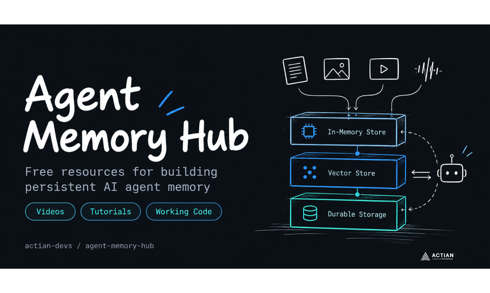

# Agent Memory Hub

Free resources for building persistent memory into AI agents. Videos, tutorials, and working code, organized by where you are in the learning curve.

**Jump to:** [Understand It](#understand-it) · [Build It](#build-it) · [Deploy It](#deploy-it) · [Get Started](#get-started)

---

## What You Will Be Able to Build

By the time you work through these resources, you will know how to:

- Build an agent that remembers users across sessions with no cloud dependency
- Replace CrewAI's default memory with a production-grade local vector store in under an hour
- Self-host mem0 entirely on your own infrastructure, with no OpenAI or Qdrant required
- Deploy persistent agent memory on edge hardware with no internet connection

All implementations use [VectorAI DB](https://www.actian.com/databases/vectorai-db/?utm_source=systemdrd&utm_medium=newsletter&utm_campaign=agent-memory&utm_content=primary-sep28) as the vector store. It runs on-prem, at the edge, and in air-gapped environments. The Community Edition is free.

---

## Resources at a Glance

| Resource | Type | Length | Level |
|---|---|---|---|
| [What Is Agent Memory? Architecture and Deployment Patterns](https://www.youtube.com/watch?v=lq9AVW87B-g) | Video | 7 min | Beginner |
| [AI Agent Memory Explained: Context Windows Aren't Enough](https://www.youtube.com/watch?v=TG1J5KYfGGc) | Video | 7 min | Beginner |
| [What You Need to Know About AI Agent Memory Architecture](https://dev.to/actiandev/what-you-need-to-know-about-ai-agent-memory-architecture-49ek) | Blog post | 13 min read | Beginner |
| [How to Build Persistent Agent Memory Across Sessions](https://actiandev.hashnode.dev/how-to-build-persistent-agent-memory-across-sessions) | Blog post | 10 min read | Intermediate |
| [How Do You Add Persistent Memory to a mem0 Agent with VectorAI DB?](https://www.youtube.com/watch?v=50JBpuoOiPU) | Video | 10 min | Intermediate |
| [How to Self-Host mem0 with a Local Vector Store](https://dev.to/actiandev/how-to-self-host-mem0-with-a-local-vector-store-21on) | Blog post | 12 min read | Intermediate |
| [Replace CrewAI Memory in Production With VectorAI DB](https://www.actian.com/blog/developer/replace-crewai-memory-in-production-with-vectorai-db/) | Blog post | 10 min read | Intermediate |
| [Build an OpenClaw Memory Plugin with Actian VectorAI DB](https://dev.to/actiandev/build-an-openclaw-memory-plugin-with-actian-vectorai-db-3gh2) | Blog post | 10 min read | Intermediate |
| [Add Persistent Memory to a Pydantic AI Agent With VectorAI DB](https://youtu.be/Gs9ybdFMqFc) | Video | — | Intermediate |
| [Add Persistent Memory to a Pydantic AI Agent With VectorAI DB](https://www.actian.com/blog/developer/add-persistent-memory-to-a-pydantic-ai-agent-with-vectorai-db/) | Blog post | 12 min read | Intermediate |
| [How Do You Build a Document Q&A Agent with LangChain and VectorAI DB?](https://www.youtube.com/watch?v=32YkFcACBGg) | Video | 4 min | Intermediate |
| [Is Agentic AI Architecture Different for On-Premises and Edge?](https://open.substack.com/pub/madamcto/p/is-agentic-ai-architecture-different) | Article | 8 min read | Advanced |
| [Edge Retrieval Pipeline with VectorAI DB (No Internet Required)](https://www.youtube.com/watch?v=GtRUOUbDTB0) | Video | 9 min | Advanced |
| [Running Gemma 2B on Edge Hardware with Actian VectorAI DB](https://actiandev.hashnode.dev/running-gemma-2b-on-edge-hardware-with-actian-vectorai-db) | Blog post | 12 min read | Advanced |
| [Gmail Reply Agent with Long-Term Memory (pydantic-ai + VectorAI DB)](https://github.com/alexeygrigorev/gmail-memory-assistant) | Working code | 15 min setup | Intermediate |

---

## Start Here Based on Where You Are

**New to agent memory?** Start with [What Is Agent Memory?](https://www.youtube.com/watch?v=lq9AVW87B-g) then read [What You Need to Know About AI Agent Memory Architecture](https://dev.to/actiandev/what-you-need-to-know-about-ai-agent-memory-architecture-49ek) and move to [How to Build Persistent Agent Memory Across Sessions](https://actiandev.hashnode.dev/how-to-build-persistent-agent-memory-across-sessions).

**Already building agents and want to add memory?** Go straight to [Build It](#build-it) and pick the framework you are already using (CrewAI, mem0, LangChain, OpenClaw, or PydanticAI).

**Deploying on-prem or edge?** Start with [Deploy It](#deploy-it).

---

## Understand It

**[What Is Agent Memory? Architecture and Deployment Patterns](https://www.youtube.com/watch?v=lq9AVW87B-g)** (7 min video)

If your agent treats every session like the first one, using a smarter model will not fix that. Models are stateless. Memory is a separate part of the system and has to be designed intentionally. This video covers what agent memory is, how it differs from training data and the context window, the three memory layers (episodic, semantic, procedural), and what choosing a storage backend actually requires you to think about: latency, privacy, accuracy, and where the system runs.

**[AI Agent Memory Explained: Context Windows Aren't Enough](https://www.youtube.com/watch?v=TG1J5KYfGGc)** (7 min video)

A bigger context window does not fix an agent that keeps forgetting things. This video explains why. You will learn the one-line distinction between context and memory, why the context window degrades as it fills (not just when it runs out), what the "lost in the middle" effect is and the accuracy hit it causes, the two failure modes behind almost every forgetting problem, and a three-question framework for designing the right memory architecture for your use case.

**[What You Need to Know About AI Agent Memory Architecture](https://dev.to/actiandev/what-you-need-to-know-about-ai-agent-memory-architecture-49ek)** (Blog post)

A written guide to how agents keep memory across sessions. It covers the four memory types (working, episodic, semantic, and procedural), five architecture patterns from a context-window-only setup to enterprise deployments with a governance layer, and the write-manage-read loop that decides what an agent remembers and how it finds it again. It also explains the "context-resident failure," where a team relies on the context window for long-term storage, and recommends starting with episodic memory backed by a flat external vector store.

---

## Build It

### Persistent memory across sessions

**[How to Build Persistent Agent Memory Across Sessions](https://actiandev.hashnode.dev/how-to-build-persistent-agent-memory-across-sessions)** (Blog post)

Your agent can follow a rule perfectly at the start of a conversation and still miss it later. Not because the model is wrong, but because developers treat the context window like a database, and it is not one. This tutorial shows you how to encode interactions as vectors, store them with agent and session metadata, and retrieve relevant context at the start of every new session. By the end, you will have a `write_memory` and `recall_memory` function your agents can call directly.

**You will learn:** how to structure memory payloads, how to upsert vectors with metadata for filtering, and how to flush writes for durability.

---

### mem0 with VectorAI DB (fully self-hosted, no OpenAI or Qdrant)

**[How Do You Add Persistent Memory to a mem0 Agent with VectorAI DB?](https://www.youtube.com/watch?v=50JBpuoOiPU)** (10 min video)

**[How to Self-Host mem0 with a Local Vector Store](https://dev.to/actiandev/how-to-self-host-mem0-with-a-local-vector-store-21on)** (Blog post)

If you have used mem0 and discovered it calls OpenAI by default, the fix is three configuration values. mem0 ships with three cloud dependencies by default: OpenAI for fact extraction, OpenAI for embeddings, and Qdrant for storage. These tutorials replace all three with local alternatives. You end up with a fully self-hosted mem0 stack where nothing leaves your infrastructure.

**You will learn:** how to configure mem0 with a custom vector store, how to swap in a local embedding model via Ollama, and how to wire VectorAI DB as the storage backend through the LangChain integration.

---

### CrewAI with VectorAI DB memory

**[Replace CrewAI Memory in Production With VectorAI DB](https://www.actian.com/blog/developer/replace-crewai-memory-in-production-with-vectorai-db/)** (Blog post)

If you have deployed a CrewAI application with `memory=True` and you are seeing `"database is locked"` errors under concurrent load, lost memory after a container restart, or memory bleeding between users in a multi-tenant deployment, all three trace to the same cause: CrewAI's default memory backend does not hold up under production conditions. This tutorial shows you how to drop in VectorAI DB as the storage backend without touching your agents or tasks. The migration path takes one new file and two lines of changes to your existing Crew instantiation.

**You will learn:** how to implement the `StorageBackend` protocol, how to scope memory per user with `root_scope`, and how to persist crew memory across runs with a local vector store.

---

### pydantic-ai with VectorAI DB memory

**[Gmail Reply Agent with Long-Term Memory (pydantic-ai + VectorAI DB)](https://github.com/alexeygrigorev/gmail-memory-assistant)** (Working code)

A Chrome extension for Gmail that drafts email replies and remembers how you like them written. It applies the persistent memory pattern from the tutorial above with [pydantic-ai](https://ai.pydantic.dev/). When you correct a draft ("for speaker invitations, keep it under 100 words and ask about the audience"), the agent saves that correction to VectorAI DB as a rule tagged with an email category. On the next relevant email, in a different thread or after a restart, it retrieves the matching rules and applies them without being told again. Rules for one kind of email don't leak into unrelated ones. A memory indicator in Gmail shows which saved rules were used for each draft. Embeddings run locally with `all-MiniLM-L6-v2`, so the memory stack stays self-hosted.

**You will learn:** how to turn user corrections into reusable long-term memories with an agent tool, how to scope retrieval by category so memories apply only where they are relevant, and how to surface memory usage in a real application.

---

### Other framework integrations

**[Build an OpenClaw Memory Plugin with Actian VectorAI DB](https://dev.to/actiandev/build-an-openclaw-memory-plugin-with-actian-vectorai-db-3gh2)** (Blog post)

Context compaction is a common failure point for OpenClaw memory systems. When the context window fills, OpenClaw compacts the session to make room for new messages. Any memory operations that were not flushed to durable storage can be lost during this transition. This tutorial replaces OpenClaw's default SQLite backend with VectorAI DB so your agent memory is semantic and searchable, and survives compaction. You will learn how OpenClaw's plugin slot system works, how to implement four memory tools (store, search, recall, forget) in TypeScript using Ollama embeddings, and how to test the full memory pipeline end-to-end.

**[How Do You Build a Document Q&A Agent with LangChain and VectorAI DB?](https://www.youtube.com/watch?v=32YkFcACBGg)** (Video)
Builds a document Q&A agent that retains context across queries. You will learn how to load and chunk documents, store embeddings in VectorAI DB via LangChain, and run similarity search to ground agent responses in source material.

---

## Deploy It

For environments where cloud access is limited or not available: factory floors, air-gapped networks, edge devices, regulated infrastructure.

**[Is Agentic AI Architecture Different for On-Premises and Edge?](https://open.substack.com/pub/madamcto/p/is-agentic-ai-architecture-different)** (Article)

Engineers moving agentic AI systems from cloud pilots into on-premises, edge, or air-gapped environments often discover that the agent fails long before the reasoning loop breaks. LangGraph users have reported conversation state disappearing after restarts despite configured checkpointers, while other teams have encountered hidden outbound dependencies that prevent startup in default-deny environments. These are documented production failures which occur below the agent layer. This article shows exactly what stays the same, what must be redesigned, and how to scope the work before you provision hardware.

**[Edge Retrieval Pipeline with VectorAI DB (No Internet Required)](https://www.youtube.com/watch?v=GtRUOUbDTB0)** (9 min video)

Builds a retrieval pipeline that runs entirely on local hardware and proves it by running the final query with the network visibly disabled. You will learn why cloud-dependent retrieval breaks for edge and air-gapped environments, how to load, chunk, and embed documents using fastembed and all-MiniLM-L6-v2 (an ONNX model that runs fully offline after a one-time download), how to upsert vectors into VectorAI DB with source metadata, and how to build a retrieval function that returns ranked results with scores without any internet access. Prerequisites: VectorAI DB running via Docker, Python 3.10+, fastembed installed.

**[Running Gemma 2B on Edge Hardware with Actian VectorAI DB](https://actiandev.hashnode.dev/running-gemma-2b-on-edge-hardware-with-actian-vectorai-db)** (Blog post)

Today, running a powerful language model entirely on edge hardware is no longer the hard part. The problem is making it useful once it is there. A developer can deploy Gemma 2B on NVIDIA Jetson Orin Nano or a custom hardware device, run inference locally, and generate responses without sending a single token to the cloud. The real challenge appears when the agent needs to answer questions from a document corpus that is far larger than anything that fits inside its context window. This tutorial builds the complete offline RAG system that solves that.

**You will learn:** how to set up local inference with Ollama, ingest a document corpus into VectorAI DB with automatic embedding dimension detection, and implement a query loop that retrieves relevant chunks and passes them to Gemma 2B for grounded response generation.

---

## Get Started

**[Download VectorAI DB Community Edition (Free)](https://www.actian.com/databases/vectorai-db/?utm_source=systemdrd&utm_medium=newsletter&utm_campaign=agent-memory&utm_content=primary-sep28)**

Runs on-prem, at the edge, and in air-gapped environments. Same API everywhere. No cloud dependency.

---

## Contributing

Found a resource that belongs here? Open an issue or submit a pull request.

---

*Maintained by [Actian for Developers](https://github.com/actian-devs)*
